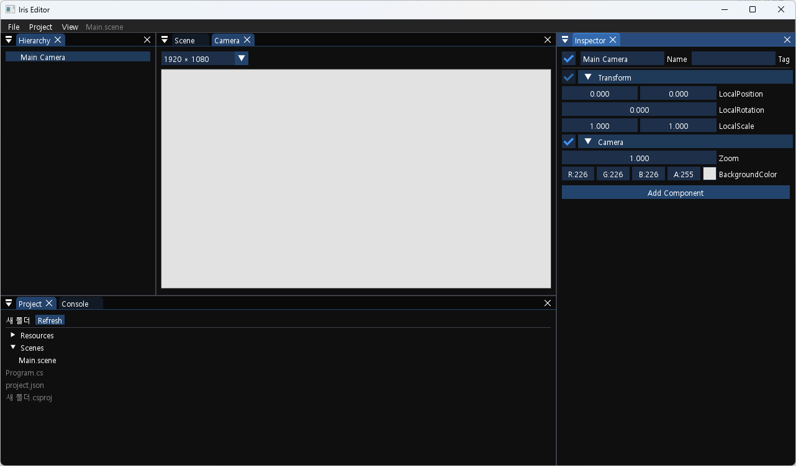
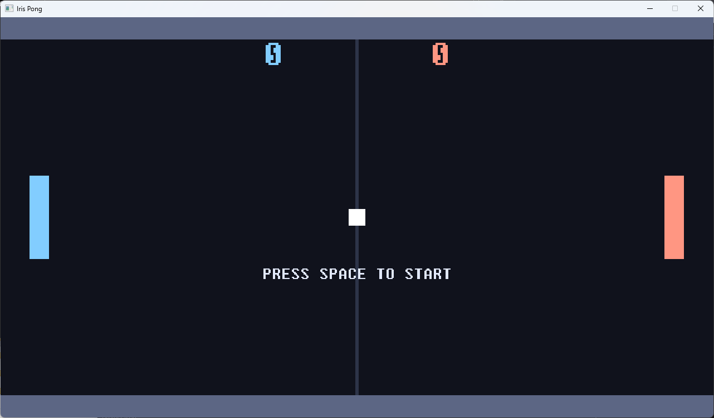

**English** | [한국어](README.ko.md)

# Iris

Iris is a 2D-only game engine written in C#, currently in development.
It ships with the C# runtime, a GUI editor, and more.

This project is under active development. APIs and engine internals may change without notice.

---

## Preview



---

## Supported Platforms

| Component | Support |
| --- | --- |
| Editor | Windows 10 / 11 (x64) |
| Game runtime | Windows 10 / 11 (x64) |

- Script editing opens in Visual Studio when it is installed; otherwise the OS default program is used.
- Cross-platform support for Linux, iOS and Android is planned.

---

## Getting Started

### 1. Install the .NET 10 SDK

[Download the .NET 10 SDK](https://dotnet.microsoft.com/download/dotnet/10.0)

### 2. Get the editor

**Download a release** — grab the latest build from [Releases](https://github.com/dkdkdsa/Iris/releases), unzip it, and run `IrisEditor.exe`.

**Build from source**

```bash
git clone https://github.com/dkdkdsa/Iris.git
cd Iris
dotnet run --project IrisEditor
```

### 3. Create a project

In the editor, choose **File -> New Project** and pick an empty folder to scaffold a game project.
Edit your scene and press **F5** to test the current scene.

### 4. Build the project

Choose **File -> Build** to build the current project.

---

## Samples



| Sample | Description | Link |
| --- | --- | --- |
| Pong | Ping pong against an AI opponent | [IrisPong](https://github.com/dkdkdsa/IrisPong) |
| _(coming soon)_ | — | — |

---

## License

MIT — [LICENSE](LICENSE)

Third-party components and their full license texts are listed in [THIRD-PARTY-NOTICES.md](THIRD-PARTY-NOTICES.md).

Games built with Iris ship alongside native binaries such as `SDL2.dll`, `cimgui.dll`, and `stbi.dll`. **You must distribute that notice file together with your game.**
